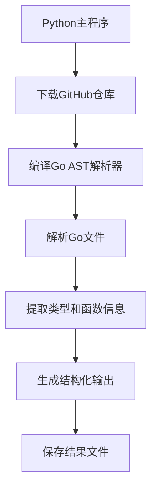

# Go语言AST代码提取工具

这是一个基于Go AST (Abstract Syntax Tree)的代码提取工具，能够从GitHub仓库中精确提取Go语言函数代码及其完整上下文。

## 🚀 新版本特性

### 基于AST的精确解析
- 使用Go官方AST包进行语法分析，100%准确解析
- 支持所有Go语法特性（泛型、方法接收器、多返回值等）
- 自动处理嵌套函数和复杂类型定义

### 完整类型上下文
- **类型定义提取**：自动提取接收器、参数、返回值的完整类型定义
- **成员函数识别**：显示类型的所有成员函数列表
- **智能上下文关联**：提供前后5个相关函数的完整实现

### 自动编译机制
- 运行时自动编译Go解析器，支持跨平台
- 智能编译缓存，提高执行效率

## 功能特点

1. **GitHub仓库下载**：自动下载和解压GitHub仓库
2. **AST精确解析**：使用Go官方语法分析器，确保100%准确性
3. **完整类型信息**：提取类型定义和成员函数信息
4. **上下文提取**：提供前后5个相关函数的完整实现
5. **智能过滤**：自动排除测试文件和测试函数
6. **批量输出**：每个函数保存为结构化的txt文件

## 使用方法

### 环境要求
1. **Python 3.6+** 和必要的Python库：
   ```bash
   pip install requests
   ```

2. **Go 1.18+** 用于编译AST解析器（会自动检测和编译）

### 快速开始

1. **准备仓库列表文件** (`repos.txt`)：
   ```text
   # 支持多个GitHub仓库
   gin-gonic/gin
   kubernetes/kubernetes
   # 添加更多仓库...
   ```

2. **运行提取工具**：
   ```bash
   python main.py
   ```

3. **查看结果**：提取的函数将保存在 `extracted_functions_ast/` 目录中

### 输出目录结构
```
extracted_functions_ast/
└── 仓库名_仓库名/
    ├── 文件名_func_1.txt
    ├── 文件名_func_2.txt
    └── ...
```

## 输出格式说明

每个函数文件包含完整的结构化信息：

```text
# PackagePath: github.com/owner/repo/path/file.go
# CodeRep: github.com/owner/repo/
# ImportPackage: "fmt"; "strings"; "time"  # 所有导入包
# RecData: type Context struct {            # 接收器类型定义
    Field1 string
    Field2 int
}
// Methods:                                # 接收器的所有成员函数
- Method1
- Method2
- ...
# ParData: param string                    # 参数定义（包含类型信息）
# ResData: (int, error)                    # 返回值定义
# BefCode: func previousFunc() {           # 前5个相关函数
    // 完整函数实现
}
# AftCode: func nextFunc() {               # 后5个相关函数  
    // 完整函数实现
}
# Prompt: func MyFunction(param string) (int, error)
# Output: {                                # 当前函数的完整实现
    // 函数体代码
}
```

## 🎯 核心优势

### 相比正则表达式版本的改进：
1. **100%准确性**：基于AST语法分析，不会遗漏或误解析
2. **完整类型信息**：自动关联类型定义和成员函数
3. **更好的上下文**：前后函数提供完整的实现代码
4. **自动依赖管理**：运行时自动编译，无需手动配置

### 示例输出
```text
# RecData: type Context struct {
    writermem responseWriter
    Request   *http.Request
    Writer    ResponseWriter
    // ... 完整结构体定义
}
// Methods:
- reset
- Copy  
- HandlerName
- HandlerNames
- // ... 150+ 成员函数
```

## 注意事项

- 需要网络连接下载GitHub仓库
- 首次运行会自动编译Go解析器（需要Go环境）
- 支持处理大型代码库，自动使用临时文件
- 输出目录会自动清空，避免重复文件

## 技术架构

