# Go语言AST代码提取工具

这是一个基于Go AST (Abstract Syntax Tree)的代码提取工具，能够从GitHub仓库中精确提取Go语言函数代码及其完整上下文。

## 🚀 新版本特性

### 基于AST的精确解析
- 使用Go官方AST包进行语法分析，100%准确解析
- 支持所有Go语法特性（泛型、方法接收器、多返回值等）
- 自动处理嵌套函数和复杂类型定义

### 完整类型上下文
- **类型定义提取**：自动提取接收器、参数、返回值的完整类型定义
- **成员函数识别**：显示类型的所有成员函数列表
- **智能上下文关联**：提供前后5个相关函数的完整实现

### 自动编译机制
- 运行时自动编译Go解析器，支持跨平台
- 智能编译缓存，提高执行效率

## 功能特点

1. **GitHub仓库下载**：自动下载和解压GitHub仓库
2. **AST精确解析**：使用Go官方语法分析器，确保100%准确性
3. **完整类型信息**：提取类型定义和成员函数信息
4. **上下文提取**：提供前后5个相关函数的完整实现
5. **智能过滤**：自动排除测试文件和测试函数
6. **批量输出**：每个函数保存为结构化的json文件

## 使用方法

### 环境要求
1. **Python 3.6+** 和必要的Python库：
   ```bash
   pip install requests
   ```

2. **Go 1.18+** 用于编译AST解析器（会自动检测和编译）

### 快速开始

1. **准备仓库列表文件** (`repos.txt`)：
   ```text
   # 支持多个GitHub仓库
   gin-gonic/gin
   kubernetes/kubernetes
   # 添加更多仓库...
   ```

2. **运行提取工具**：
   ```bash
   python main.py
   ```

3. **查看结果**：提取的函数将保存在 `extracted_functions_ast/` 目录中

### 输出目录结构
```
extracted_functions_ast/
└── 仓库名_仓库名/
    ├── 文件名_func_1.json
    ├── 文件名_func_2.json
    └── ...
```

## 输出格式说明

每个函数文件包含完整的结构化信息，使用JSON格式：

```json
{
    "package_path": "github.com/owner/repo/path/file.go",
    "code_rep": "github.com/owner/repo/",
    "import_package": ["fmt", "strings", "time"],
    "receiver": "type Context struct {\n    Field1 string\n    Field2 int\n}",
    "methods": ["Method1", "Method2"],
    "params": "param string",
    "returns": "(int, error)",
    "before_funcs": [
        "func previousFunc() {\n    // 完整函数实现\n}"
    ],
    "after_funcs": [
        "func nextFunc() {\n    // 完整函数实现\n}"
    ],
    "prompt": "func MyFunction(param string) (int, error)",
    "output": "// 当前函数的完整实现\nfunc MyFunction(param string) (int, error) {\n    // 函数体代码\n}"
}
```

## 🎯 核心优势

### 相比正则表达式版本的改进：
1. **100%准确性**：基于AST语法分析，不会遗漏或误解析
2. **完整类型信息**：自动关联类型定义和成员函数
3. **更好的上下文**：前后函数提供完整的实现代码
4. **自动依赖管理**：运行时自动编译，无需手动配置

### 示例输出
```json
{
    "package_path": "github.com/gin-gonic/gin/context.go",
    "code_rep": "github.com/gin-gonic/gin/",
    "import_package": ["errors", "fmt", "net/http"],
    "receiver": "type Context struct {\n    writermem responseWriter\n    Request   *http.Request\n    Writer    ResponseWriter\n}",
    "methods": ["reset", "Copy", "HandlerName", "HandlerNames"],
    "params": "param string",
    "returns": "(int, error)",
    "before_funcs": [
        "func previousFunc() {\n    // 完整函数实现\n}"
    ],
    "after_funcs": [
        "func nextFunc() {\n    // 完整函数实现\n}"
    ],
    "prompt": "func Next() (*http.Request, ResponseWriter)",
    "output": "func (c *Context) Next() {\n    c.index++\n    for c.index < len(c.handlers) {\n        c.handlers[c.index](c)\n        c.index++\n    }\n}"
}
```

## 注意事项

- 需要网络连接下载GitHub仓库
- 首次运行会自动编译Go解析器（需要Go环境）
- 支持处理大型代码库，自动使用临时文件
- 输出目录会自动清空，避免重复文件

## 技术架构

```mermaid
graph TD
    A[Python主程序] --> B[下载GitHub仓库]
    B --> C[编译Go AST解析器]
    C --> D[解析Go文件]
    D --> E[提取类型和函数信息]
    E --> F[生成结构化输出]
    F --> G[保存结果文件]
```

